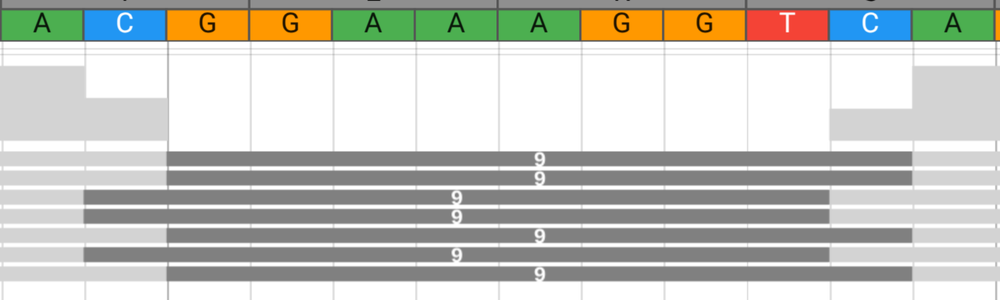
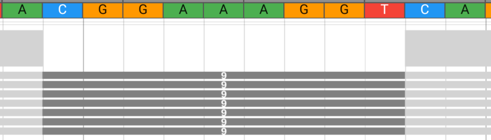

# gtamap

Gtamap is a specialized gene-focused read mapper that thoroughly analyzes paired-end 
DNA and RNA data against a single reference gene, capturing all possible evidence 
including splice variants that conventional mappers might miss when distributing 
reads across the whole genome.

## Procedure

The mapping procedure is divided into passes, each serving a specific purpose and refining the mapping results.

### First Pass (Initial Mapping)
The first pass is the initial mapping of reads to the reference genome.
Reads are aligned to the reference genome using a kmer-based approach.
When the read can not be aligned sufficiently, it is stored for the second pass.

### Second Pass (Refined Mapping)
Reads that could not be aligned in the first pass are re-analyzed using information from the first pass.
Usually reads that span across a splice junction and have not enough exact k-mer matches beyond the gap are re-analyzed.

### Third Pass (Resolving Inconsistencies)
The third pass is used to resolve inconsistencies in the mapping results.
This is done by analyzing the mapping results of the first and second passes.
The goal is to identify and resolve any discrepancies or conflicts in the mapping data such as 
inconsistent gaps or haplotypes.

### Fourth Pass (Resolving Ambiguities)
The fourth pass is used to resolve ambiguities in the mapping results.
Reads that could be aligned to the given reference are mapped agains similar genomic regions.

### Second Pass
During the initial pass, some reads may not be mappable with sufficient confidence. 
These reads are stored and re-analyzed in a second pass.

Reasons to be not mappable in the first pass:
- Maps to multiple locations within the same gene with sufficient confidence
- Bounds of kmers / read are not uniquely mappable (mismatches, indels, etc)

## Deletions and Introns

Deletions and introns are detected in a similar fashion as they both represent a
continous read sequence and a discontinuous reference sequence (gap in reference).

A gap is categorized as a deletion if the number of skipped bases is less than the 
configured number of intron bases.

### Left Normalization

There exists a decision problem when there are bases that can be assigned to both sides of the gap.

In this example, the sequenced individual has a 9bp deletion.

The read sequence is `ATACAGT` which leaves the `C` base to be assigned to both sides of the gap.

The gap could either be `CGGAAAGGT` or `GGAAAGGTC`.

Left normalization uses the leftmost beginning for the gap.