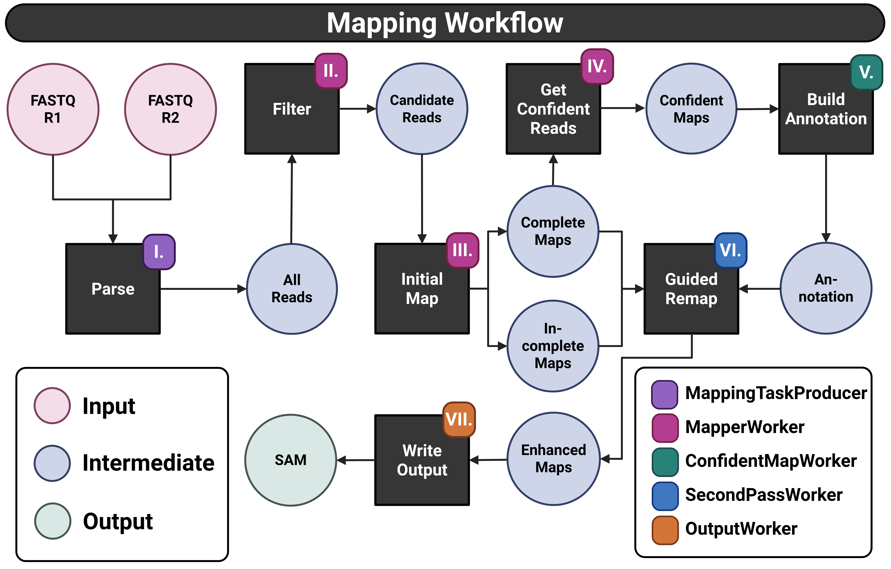

# GTAMap
Accurate read mapping is foundational to RNA-seq and DNA-seq analysis, yet
standard genome-wide mappers face a fundamental trade-off: their optimization
for throughput necessitates per-read computational budget. While enabling
practical performance at scale, these constraints cause mappers to
systematically discard reads with plausible alignments in highly mutated,
repetitive, or complex regions. Such discrepancies accumulate across datasets
and directly impact downstream analyses like differential gene expression,
potentially leading to divergent biological conclusions. `GTAMap` (Gene Targeted
Alignment Map) is a specialized and annotation-independent mapper that inverts
the traditional mapping paradigm. Rather than identifying the single best
genome-wide positions, `GTAMap` exhaustively reports all plausible alignments
within user-defined genomic or transcriptomic targets. `GTAMap` is a versatile
mapper, enabling RNA-seq mapping to genomic target sequences with dynamic
annotation building during first-pass alignment, RNA-seq mapping to
transcriptome target sequences, and DNA mapping to genomic targets. All modes
support optional region masks that specify custom mismatch thresholds for any
region within targets, using a priority system to resolve overlapping mask
definitions. By confining the search space to relevant regions, `GTAMap` enables
aggressive read filtering, eliminating non-candidate reads early and
dramatically reducing computational overhead. The saved resources enable
relaxed alignment constraints and exhaustive reporting of all valid alignments
without arbitrary selection of single best hits. `GTAMap`'s gene-wise indexing
strategy produces indices of comparable size to those generated by traditional
mappers for the same target regions, while achieving faster median runtimes
across nearly all evaluated scenarios. This targeted approach makes detailed
inspection workflows tractable for specific genes of interest. Benchmarking
against [`Minimap2`](https://github.com/lh3/minimap2), [`HISAT2`](https://github.com/DaehwanKimLab/hisat2), [`STAR`](https://github.com/alexdobin/STAR), [`BWA`](https://github.com/lh3/bwa?tab=readme-ov-file), and [`Bowtie2`](https://github.com/BenLangmead/bowtie2)
on simulated data demonstrates that while all mappers perform
reasonably well, they systematically produce incomplete alignments due to
conservative reporting strategies, aggressive clipping at junction boundaries,
and refusal to report multimappings in repetitive regions. `GTAMap` achieves
comparable or superior median GeneMapperScore across biologically realistic
mutation rates (0-3\%) while maintaining faster runtimes on targeted regions
(especially when compared to `BWA` and `Bowtie2`) and
exhaustively reporting all valid alignment candidates. 
`GTAMap` addresses a specific but important novel approach: scenarios requiring
exhaustive alignment evidence within user-defined gene sets, such as validating
expression from lowly-expressed genes, characterizing complex loci, or
investigating genes in repetitive regions.


> This figure was created using BioRender. For more information, visit [BioRender](https://BioRender.com).

## Usage
### `index-pre`
```
Usage:
  gtamap index-pre [flags]

Flags:
  -d, --downstream int           Number of bases to add downstream of the gene end position.
  -f, --fasta string             Fasta file (required)
      --fasta-file-name string   Output FASTA file name (within output directory) (only for --single-file) (default: genes.fa)
  -i, --fasta-index string       Fasta index file (default: [--fasta].fai)
  -l, --gene-ids strings         Gene IDs to extract (comma-separated). If not provided, all genes are extracted.
  -g, --gtf string               Genome annotation file (.gtf) (required)
  -h, --help                     help for index-pre
  -o, --output string            Output directory
  -s, --single-file              Write all gene sequences to a single fasta file
  -u, --upstream int             Number of bases to add upstream of the gene start position.

Global Flags:
      --config string     Path to config YAML
      --loglevel string   Log output level (ERROR, INFO, DEBUG) (default "INFO")

```

### `index`
```
Usage:
  gtamap index [flags]

Flags:
  -f, --fasta string             Fasta file (required)
  -h, --help                     help for index
  -i, --index-file-name string   Output gtamap index file name (within output directory) (default: index.gtai)
  -o, --output string            Output directory (required)
  -m, --regionmask string        Regionmask file (.bed) containing specific mismatch constraints per region
  -u, --use-fasta-file-name      Use the name of the fasta file (without extension) as index file name (within output directory)

Global Flags:
      --config string     Path to config YAML
      --loglevel string   Log output level (ERROR, INFO, DEBUG) (default "INFO")
```
### `map`
```
Usage:
  gtamap map [flags]

Flags:
  -h, --help                   help for map
  -i, --index string           Index file (*.gtai) (required)
  -o, --output string          Output directory (required)
  -p, --progress string        Progress file name (within output dir) or full path (default: mapping_progress.tsv)
  -r, --read-origin string     Specify read origin: 'dna' or 'rna' (required)
  -1, --reads-r1 string        FASTQ file containing the R1 reads (required)
  -2, --reads-r2 string        FASTQ file containing the R2 reads (if paired-end)
  -f, --sam-file-name string   Output SAM file name (within output directory) (default: aligned.sam)
  -e, --stagetime string       Progress stage time file name (within output dir) or full path (default: mapping_stage.tsv)
  -s, --stats string           Mapping statistics file name (within output dir) or full path (default: mapping_stats.tsv)
  -t, --threads int            Number of threads to use (default: all available)

Global Flags:
      --config string     Path to config YAML
      --loglevel string   Log output level (ERROR, INFO, DEBUG) (default "INFO")
```


